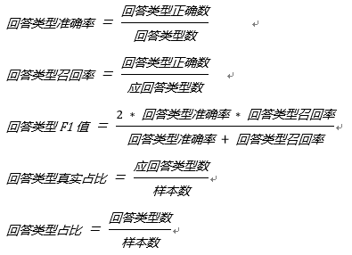

# 运行说明
本示例给出了支持一层和两层结构知识库问答运行demo、评测指标及在测试集的效果。

## 数据介绍
[data_demo](../data_demo)所给出的预训练集（pre_train_data），训练集（train_data），验证集(valid_data)，预测集(test_data) 取自58智能问答生产环境下的真实数据，这里仅为了跑通模型，因此只取了少部分数据，其中预训练集9W+（真实场景下数量较大），训练集9W+，验证集和测试集均3000+，具体数据格式可见[README](../README.md)中的数据介绍部分。

## 基于一层结构知识库的自动问答运行示例

### 基于DSSM模型的自动问答

使用DSSM意图匹配模型时，对于一层结构知识库只需要先训练意图匹配模型，然后用训练好的模型对测试集进行预测，最后对意图匹配的结果按照打分阈值高低给出回答类别，当意图匹配打分高于某个阈值时给出唯一回答，当打分低于某个阈值时给出拒识回答，当打分处于这两个阈值之间时给出列表回答。

#### 1.训练DSSM意图匹配模型

```bash
mkdir model && python run_dssm.py --train_path=./data_demo/train_data --valid_path=./data_demo/valid_data --map_file_path=./data_demo/std_data --model_path=./model/model_min/ --result_file_path=./data/result_min --softmax_r=45 --embedding_size=256 --learning_rate=0.001 --keep_prob=0.8 --batch_size=250 --num_epoches=30 --negative_size=200 --eval_every=10 --num_units=256 --use_same_cell=False --label2id_path=./model/model_min/min_label2id --vocab2id_path=./model/model_min/min_vocab2id
```

#### 2.用意图匹配模型对测试集进行预测

```bash
python dssm_predict.py --map_file_path=./data_demo/std_data --model_path=./model/model_min/ --export_model_dir=./model/model_min/dssm_tf_serving/ --test_data_path=./data_demo/test_data --test_result_path=./model/model_min/result_min_test --softmax_r=45 --batch_size=250 --label2id_file=./model/model_min/min_label2id --vocab2id_file=./model/model_min/min_vocab2id
```

#### 3.意图匹配的结果按照打分阈值高低给出回答类别

```bash
python merge_classifier_match_label.py none ./model/model_min/result_min_test ./data_demo/merge_result_1_level none
```

### 基于轻量级预训练语言模型（SPTM）的自动问答

使用SPTM进行意图匹配时，对于一层结构知识库需要先预训练语言模型，然后基于预训练语言模型与训练集微调意图匹配模型；最终在用训练好的模型对测试集进行预测后，对意图匹配的结果按照打分阈值高低给出回答类别。其阈值判别的方式与无预训练场景相同。

#### 1.预训练语言模型

```bash
cd sptm && mkdir -p model/pretrain && python run_pretraining.py --train_file="../data_demo/pre_train_data" --vocab_file="../data_demo/vocab" --model_save_dir="./model/pretrain" --batch_size=256 --print_step=100 --weight_decay=0 --embedding_dim=1000 --lstm_dim=500 --layer_num=1 --train_step=100000 --warmup_step=1000 --learning_rate=5e-5 --dropout_rate=0.1 --max_predictions_per_seq=10 --clip_norm=1.0 --max_seq_len=100 --use_queue=0
```

#### 2.微调意图匹配模型

注意此处的```init_checkpoint```需要根据预训练的结果进行选取，如没有预训练模型，也可以不填写：

```bash
cd sptm && python run_classifier.py --output_id2label_file="model/id2label.has_init" --vocab_file="../data_demo/vocab" --train_file="../data_demo/train_data" --dev_file="../data_demo/valid_data" --model_save_dir="model/finetune" --lstm_dim=500 --embedding_dim=1000 --opt_type=adam --batch_size=256 --epoch=20 --learning_rate=1e-4 --opt_type=adam --seed=1 --max_len=100 --print_step=10 --dropout_rate=0.1 --layer_num=1 --init_checkpoint="model/pretrain/lm_pretrain.ckpt-1400"
```

#### 3.用意图匹配模型对测试集进行预测

```bash
cd sptm && python run_prediction.py --input_file="../data_demo/test_data" --vocab_file="../data_demo/vocab" --id2label_file="model/id2label.has_init" --model_dir="model/finetune" > "../data_demo/result_pretrain_raw"
```

#### 4.预测结果格式化，按照打分阈值高低给出回答类别

```bash
python pretrain/format_result.py ./data_demo/test_data ./data_demo/result_pretrain_raw ./data_demo/result_pretrain_test

python merge_classifier_match_label.py none ./data_demo/result_pretrain_test  ./data_demo/merge_result_pretrain none
```

## 基于两层结构知识库的自动问答运行示例
对于两层结构知识库需要先训练领域分类模型和意图匹配模型，然后用训练好的模型对测试集进行预测，最后对领域分类和意图匹配的结果进行融合，给出回答类别，具体融合策略参考README中两层结构知识库问答融合示意图。

### 1.训练LSTM领域分类模型

```bash
mkdir model && python run_bi_lstm.py  --train_path=./data_demo/train_data --valid_path=./data_demo/valid_data --map_file_path=./data_demo/std_data --result_file=./data_demo/result_max_valid --model_path=./model/model_max --vocab_file=./model/model_max/vocab_max --label_file=./model/model_max/label_max --embedding_size=256 --num_units=256 --batch_size=200 --seq_length=40 --num_epcho=30 --check_every=20 --lstm_layers=2 --lr=0.01 --dropout_keep_prob=0.8
```

### 2.用领域分类模型对测试集进行预测

```bash
python lstm_predict.py --map_file_path=./data_demo/std_data --model_path=./model/model_max --test_data_path=./data_demo/test_data --test_result_path=./model/model_max/result_max_test --batch_size=250 --seq_length=40 --label2id_file=./model/model_max/label_max --vocab2id_file=./model/model_max/vocab_max
```

### 3.训练DSSM意图匹配模型
```bash
python run_dssm.py --train_path=./data_demo/train_data --valid_path=./data_demo/valid_data --map_file_path=./data_demo/std_data --model_path=./model/model_min/ --result_file_path=./data/result_min --softmax_r=45 --embedding_size=256 --learning_rate=0.001 --keep_prob=0.8 --batch_size=250 --num_epoches=30 --negative_size=200 --eval_every=10 --num_units=256 --use_same_cell=False --label2id_path=./model/model_min/min_label2id --vocab2id_path=./model/model_min/min_vocab2id
```

### 4.用意图匹配模型对测试集进行预测

```bash
python dssm_predict.py --map_file_path=./data_demo/std_data --model_path=./model/model_min/ --export_model_dir=./model/model_min/dssm_tf_serving/ --test_data_path=./data_demo/test_data --test_result_path=./model/model_min/result_min_test --softmax_r=45 --batch_size=250 --label2id_file=./model/model_min/min_label2id --vocab2id_file=./model/model_min/min_vocab2id
```

### 5.领域分类结果&意图匹配结果进行融合

```bash
python merge_classifier_match_label.py ./model/model_max/result_max_test ./model/model_min/result_min_test ./data_demo/merge_result_2_level ./data_demo/std_data
```

## 模型评测指标及测试集效果

目前qa_match的问答效果评测是基于分类模型的评测，主要看在模型各种回答类型（唯一回答，列表回答，拒绝回答）占比接近真实应回答类型占比下各种回答的类型的准确率、召回率、F1值，具体定义如下：



对上述一层结构知识库和二层结构知识库示例（数据集具体见[data_demo](../data_demo)）运行后评测效果如下（使用通用深度学习推理服务[dl_inference](https://github.com/wuba/dl_inference)开源项目部署模型来评测推理耗时）：

| 数据集           | 模型                                                         | **唯一回答准确率** | **唯一回答召回率** | **唯一回答**F1 | **CPU**机器上推理耗时 |
| ---------------- | ------------------------------------------------------------ | ------------------ | ------------------ | -------------- | --------------------- |
| 一级知识库数据集 | DSSM[[下载](http://wos.58cdn.com.cn/nOlKjIhGntU/qamatch/model_min.zip)] | 0.8398             | 0.8326             | 0.8362         | **3ms**               |
| 一级知识库数据集 | SPTM[[下载](http://wos.58cdn.com.cn/nOlKjIhGntU/qamatch/model_pretrain.zip)] | 0.8841             | 0.9002             | 0.8921         | 16ms                  |
| 二级知识库数据集 | LSTM+DSSM融合模型[[下载](http://wos.58cdn.com.cn/nOlKjIhGntU/qamatch/model_merge.zip)] | 0.8957             | 0.9027             | **0.8992**     | 18ms                  |

说明：由于示例数据中列表回答真实占比较小，这里我们主要看唯一回答的准确率、召回率和F1值。对于二级知识库数据集，我们也可以使用预训练模型来完成自动问答，这里不做过多描述。
